# my_company
Simple script to show basic operation in any organization like display all employee, create new employee, assign department and positions.

# Steps to run this script:
### Step 1.
Create a folder.

$ mkdir my_company

Create a virtual enviroment.

$pip install virtualenv

$ cd my_company

$ virtualenv env

$ source env/bin/activate

### Step 2.
Install requirements.txt

$pip install -r requirements.txt

### Step 3.
In order to establish the connection with database, edit the following function with your own database credentials.

'''----------- Function to establish a connection with database -----------'''

def dbconnect():
    
    try:
       
       db = MySQLdb.connect(
           
           host="127.0.0.1",
           
           user="username", (database username)
           
           passwd="password", (database password)
        )
    except Exception as e:
        sys.exit("Can't connect to Database")
    return db

### Step 4.
Open my_company.py file in PyCharm and run.

# ---- Demo ----
Let's suppose we have a small organization. Our database consists of two tables, employee and departments.
### Employee table.
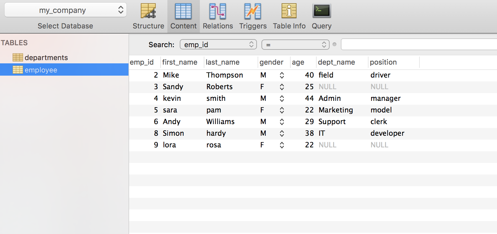
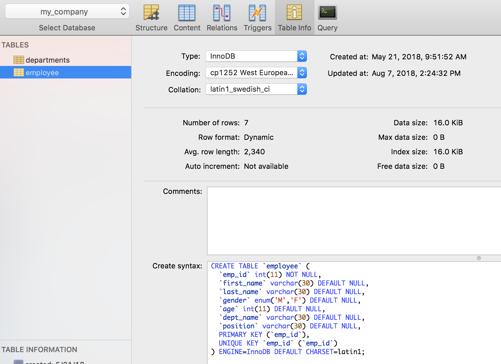

### Departments table.
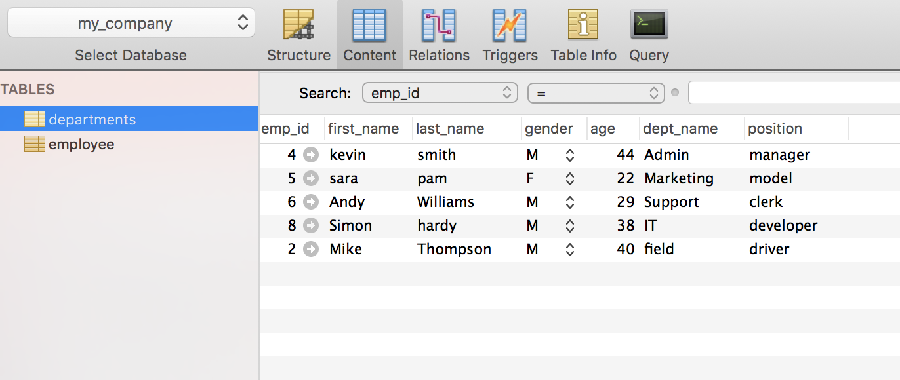
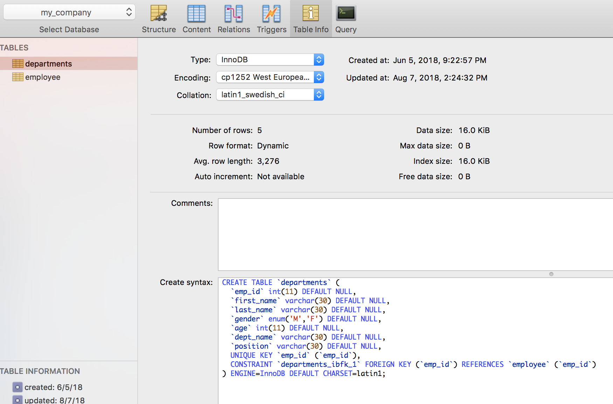

### Running the script.
You will get an option window as soon as you run the script.

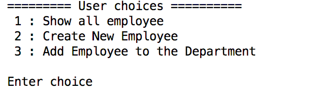

### Select option 1.
If your select the option 1, this will display the employee table 

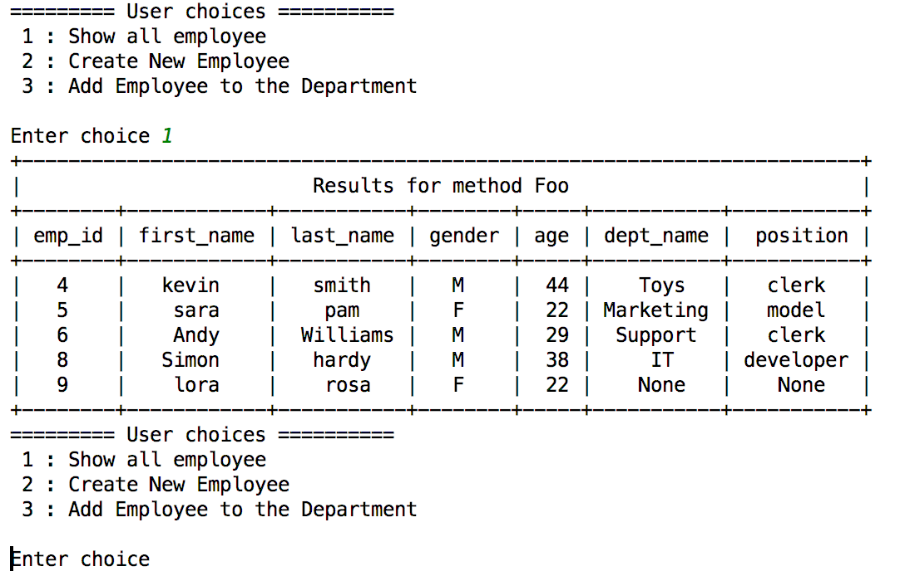

### Select option 2.
If your select the option 2, this will ask you to create a new employee. First you have to create a new employee id, this will check whether emp id is already exists or not. If not than it will create a new employee. just in case, if employee already exists, prompt a warning message that the employee is already exists.

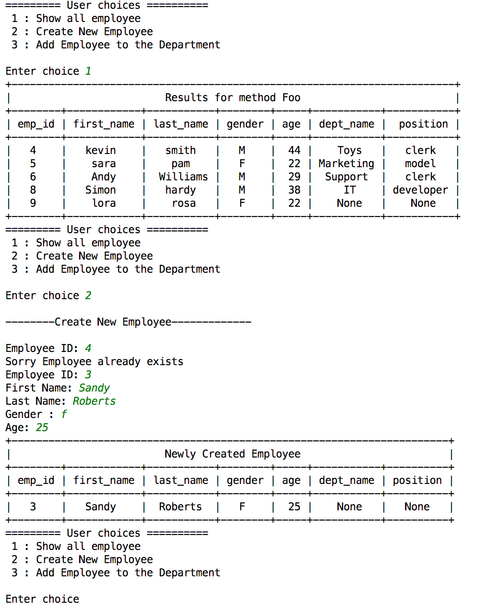

### Select option 3.
if you select option 3. The very first thing will be check is that employee exists, if it does, than check either employee have department & position. if yes than it will show you an option "Would you like to update employee Department & Position?".

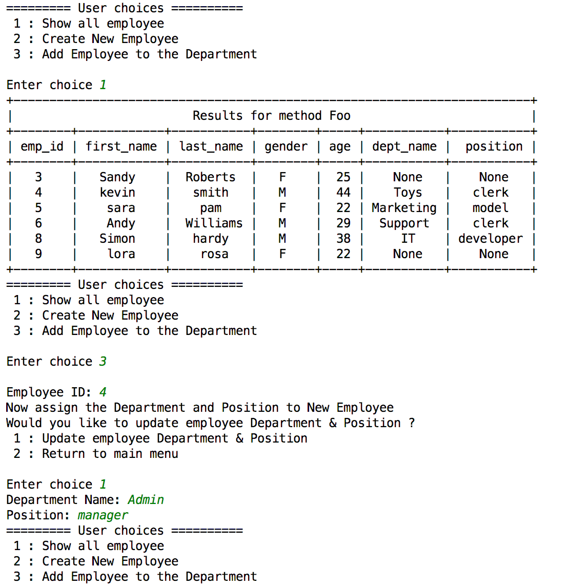
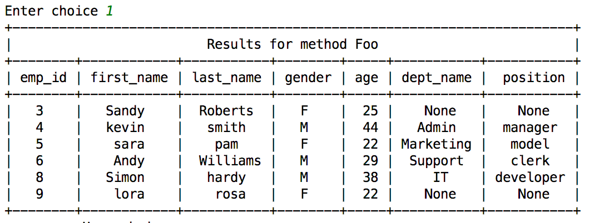

Let's suppose if employee doesn't exists. In this case, it will first create an employee.

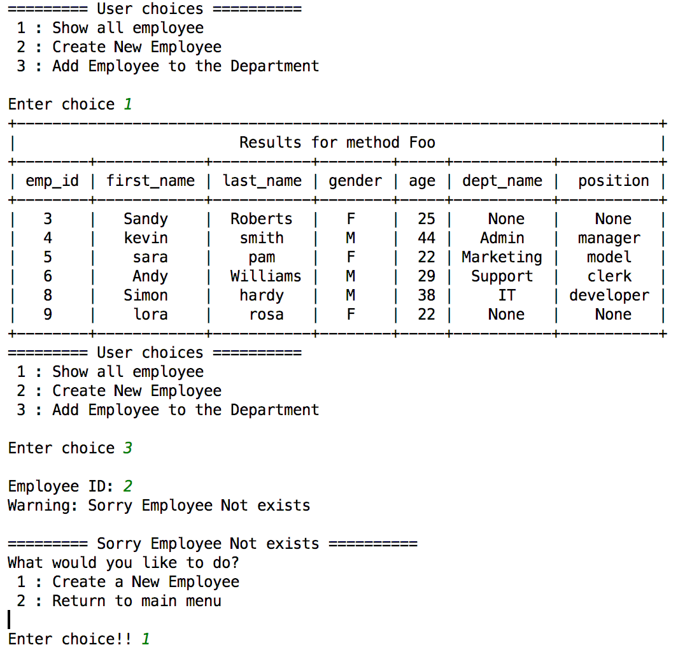
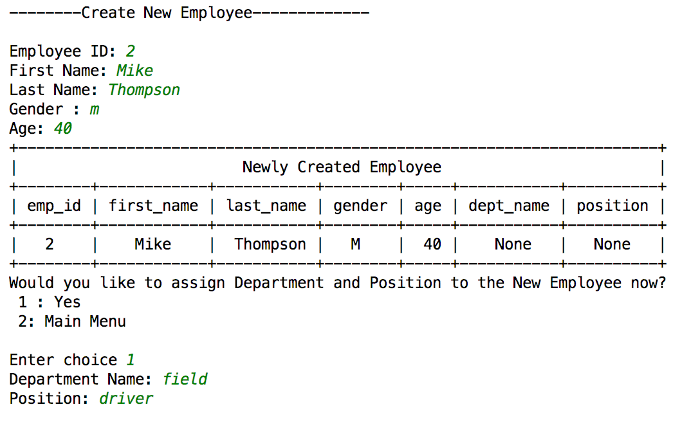
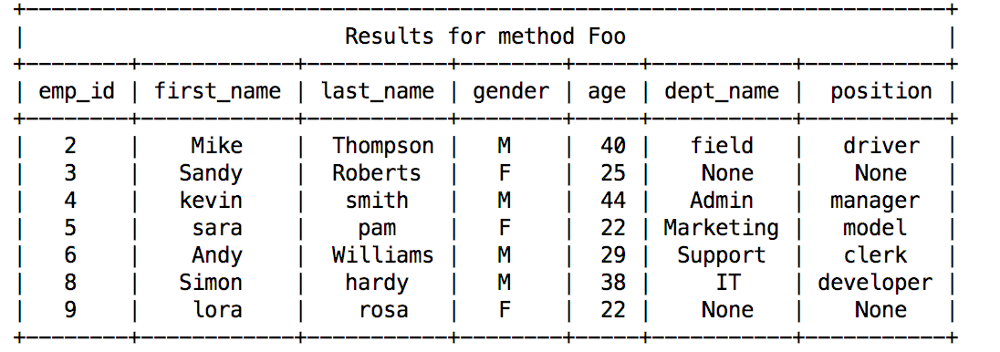
